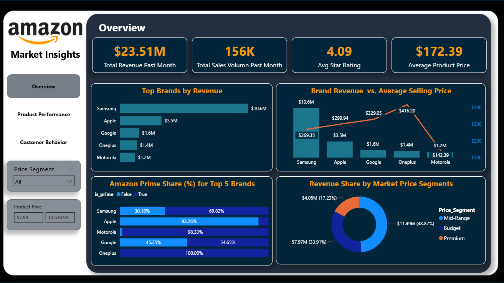
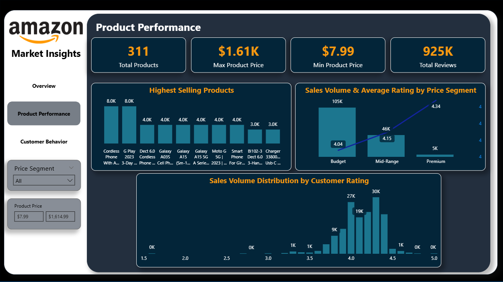
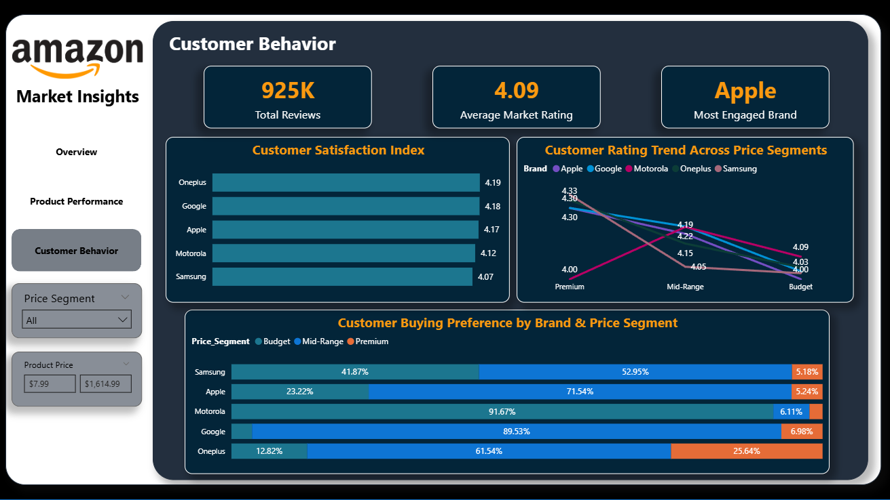

# Amazon Phones Market Analysis (Power BI Dashboard)

##  Project Overview
This project presents an end-to-end data analysis and visualization dashboard built in **Power BI**. The analysis explores Amazon phone sales data, evaluating market trends, brand positions, and consumer engagement metrics.

##  Data Cleaning & Transformation (Power Query)
Before building the visuals, a rigorous data cleaning process was executed to ensure data integrity and accurate reporting:
* **Brand Standardization (`Brand_Final`):** Extracted clean brand names from messy product titles and handled missing or mis-classified brand data.
* **Metric Conversion:** Cleaned and transformed columns like `product_price` and `product_rating_clean` into proper decimal and numeric formats, stripping out non-numeric scraping artifacts.
* **Sales Volume Optimization (`Cleaned_Sales_Volume`):** Cleaned the scrapped sales text into clear integer values representing actual units sold.
* **Data Categorization:** Built custom conditional columns to segment products into clear categories like **Price Segments** (Budget, Mid-Range, Premium).

##  Dashboard Pages & Features
The dashboard consists of **3 main interactive pages**:

1. **Market Overview:** 
   - Displays core KPIs (Total Sales, Revenue, Total Reviews, and Average Price).
   - Features a **Price Premium Analysis** comparing *Total Revenue vs. Average Selling Price (ASP)* to identify market leaders (e.g., Apple and Samsung) that possess high brand equity.
   
2. **Product Performance:**
   - Tracks the Top 10 selling smartphone models.
   - Evaluates sales volume distribution across different customer rating scores.
   - Integrated with advanced slicers, including a dynamic price range tool.

3. **Customer Behavior:**
   - Analyzes consumer elasticity by plotting *Sales Volume vs. Number of Reviews* (Scatter Chart).
   - Investigates price preferences and brand loyalty trends across price segments.

##  Screenshots
*Note: Replace these with your actual image paths once uploaded to the Screenshots folder.*
- **Overview Page:** 
- **Product Performance:** 
- **Customer Behavior:** 

##  Advanced DAX Measures Created
To drive deep business insights, several advanced DAX measures were implemented:
* **Total Revenue:** Evaluated by multiplying sales volume by product prices to capture the true financial impact of premium brands.
* **Most Engaged Brand:** Dynamically calculates the brand that receives the highest total number of customer reviews.
* **Highest Rated Brand:** Measures the brand with the highest average customer satisfaction score across the marketplace.

##  Key Business Insights Found
* **Market & Revenue Leadership (Samsung):** Samsung is the undisputed market leader, capturing **$10.6M** out of the **$23.51M** total market revenue, driven by a strong volume-to-price balance (Average Selling Price of **$269.35**).
* **The Premium Pricing Play (OnePlus):** Surprisingly, OnePlus commands the highest Average Selling Price (ASP) at **$416.20**, outpricing both Apple and Samsung on this dataset. Furthermore, **25.64%** of all OnePlus sales come directly from the Premium segment, yielding a high Customer Satisfaction Index of **4.19**.
* **Volume vs. Value Drivers:** The **Mid-Range** segment acts as the primary financial driver, generating **48.87% ($11.49M)** of total revenue. Conversely, the **Budget** segment drives absolute market penetration with **105K** units sold, compared to just **5K** units in the Premium tier.
* **Price Elasticity & Satisfaction:** A clear positive correlation exists between higher price tiers and customer satisfaction. The average market rating scales from **4.04** (Budget) up to **4.34** (Premium). Apple leads premium-tier satisfaction with a rating of **4.33**, closely followed by Samsung at **4.30**.
* **Customer Engagement:** Apple stands out as the **Most Engaged Brand** with heavy review interaction, emphasizing that premium customers are highly active in leaving feedback, which creates vital social proof for prospective buyers.
## Tech Stack Used
- **Power BI Desktop** (Data Modeling, DAX Measures, and UI Design)
- **Power Query** (Data Cleaning & Transformation)
